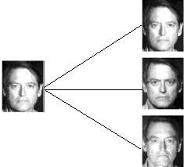

# Face-image-Recognition

# Face Verification

* Face Authentication (also called verification) involves a one to one check that compares an input image (also called a query image, probe image or simply probe) with only the image (or class) that the user claims to be. In simple words, if you stand in front of a face authentication system and claim to be a certain user, the system will ONLY check if you are that user or not.

# Face Recognition

* Face Recognition (or Identification) is another thing, though ofcourse related. It involves a one to many comparison of the input image (or probe or query image) with a template library. In simple words, in a face recognition system the input image will be compared with ALL the classes and then a decision will be made so as to identify to WHO the the input image belongs to. Or if it does not belong to the database at all.

Like I just said before, though both Authentication and Recognition are related there are some differences in the method involved, which are obvious due to the different nature of both.

# Face(image) Verification and Recognition
------------------------------------------------------------------------------
Follow this Steps to Understand and Perform the Verification and Recognition Of Images

     1. Go through the file:- Training_Model_A  to Understand the CNN Model on Devanagari Dataset
            a. It Contain How to access the file images
            b. How to make CNN model and training steps
            c. How to save your trained model
    
    2. After Step_1 follow the content of  Transfer_Learning _Model_B   to Understand the following Concepts:-
            a. How to Access Pre Trained Model
            b. How to Perform Face Verification 
            c. How to Perform Face Recognition
                       

You can download the trained model file from this link:- "https://drive.google.com/open?id=1GfmuLXdb7ZeIp96rPdJjJaoGHB4o4Lji"

You can download the dataset from this link :- https://drive.google.com/open?id=1214jBIXpQpe5lQg9iMPOUpAiKvk2slK7
    
I Strongly recommended that use google colab to retrieve data and run code.

# To Run this code follow this steps:-
  1. Download the dataset from given link and extract it.
  2. Collect all the files like code files,Image files and train file in single directory just by cloning github.
  3. And just go through Training_Model_A and Transfer_Learning_Model_B.

